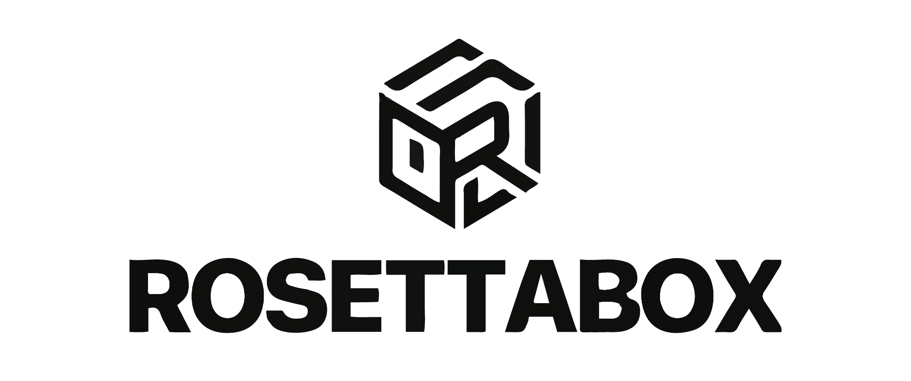

<p align="center">
  
</p>

<h3 align="center">Enterprise On-Premise AI Voice Transcription & Summarization</h3>

<p align="center">
  Turn hours of audio into structured, actionable documents — fully offline, zero data leakage.
</p>

---

## What is RosettaBox?

RosettaBox is a fully on-premise AI system that transforms audio recordings into structured, AI-organized summaries. It combines GPU-accelerated speech recognition (Whisper ASR) with large language models (Ollama / vLLM) in a single appliance — no cloud dependency, no data leaving your network.

Named after the Rosetta Stone — the key that unlocked ancient languages — RosettaBox unlocks the knowledge trapped in your organization's voice recordings.

## Key Features

| | Feature | Description |
|---|---------|-------------|
| **Audio** | Multi-format transcription | MP3, WAV, FLAC, M4A, OGG, WMA, AAC and more (14 formats, up to 3 GB / 12 hrs) |
| **Speed** | GPU-accelerated ASR | faster-whisper with CUDA — 10x faster than CPU, 30+ languages |
| **AI** | Smart summarization | 6 processing modes × 5 output formats — meetings, interviews, lectures, custom |
| **Batch** | Queue processing | Upload up to 5 files at once, 100-task automatic queue management |
| **Domain** | Hot words / terminology | Custom vocabulary for company-specific jargon, names, product codes |
| **Audio** | Intelligent preprocessing | High-pass filtering (80 Hz), LUFS normalization, optional noise reduction |
| **Notify** | Email delivery | Auto-send structured results with full transcript upon completion |
| **Text** | Direct text processing | Paste text directly for AI summarization — no audio required |
| **API** | RESTful API v1 | API Key + HMAC authentication, integrate with ERP / CRM / knowledge bases |

## Architecture

```
┌─────────────────────────────────────────────────────┐
│                    Frontend (React)                  │
│              Vite + Tailwind CSS                     │
└──────────────────────┬──────────────────────────────┘
                       │ REST API
┌──────────────────────▼──────────────────────────────┐
│                 Backend (Flask)                       │
│                                                      │
│  Controllers ─► Services ─► Processing ─► Utils      │
│                                                      │
│  ┌─────────────┐  ┌──────────────┐  ┌────────────┐  │
│  │  ASR Engine  │  │  AI Engine   │  │ Task Queue │  │
│  │ faster-whisper│  │ Ollama/vLLM │  │ Producer-  │  │
│  │  + CUDA GPU  │  │  Local LLM   │  │ Consumer   │  │
│  └─────────────┘  └──────────────┘  └────────────┘  │
└─────────────────────────────────────────────────────┘
```

## Quick Start

### Prerequisites

- Python 3.10+
- Node.js 18+
- NVIDIA GPU with CUDA support
- FFmpeg
- Ollama or vLLM (for LLM inference)

### Setup

```bash
# Clone
git clone https://github.com/LeoJ1mmy/Rosettabox.git
cd Rosettabox

# Backend
python -m venv venv
source venv/bin/activate
pip install -r requirements.txt

# Frontend
cd frontend
npm install
cd ..

# Configure
cp .env.example .env   # Edit with your settings

# Run
./manage.sh start-dev
```

### Docker

```bash
docker compose build
docker compose up -d
```

## Management

```bash
./manage.sh start-all      # Start all services
./manage.sh start-dev      # Development mode (hot-reload)
./manage.sh start-prod     # Production mode (Docker)
./manage.sh stop-all       # Stop everything
./manage.sh status         # Service health check
./manage.sh logs-dev       # View logs
```

## API

RosettaBox provides a RESTful API (v1) with API Key + HMAC signature authentication for system integration. See [`backend/external_api/docs/`](backend/external_api/docs/API_README.md) for full documentation.

## Tech Stack

**Backend:** Python, Flask, faster-whisper, Ollama/vLLM, CUDA

**Frontend:** React 18, Vite, Tailwind CSS

**Infrastructure:** Docker, Supervisor, Nginx

## Hardware Reference

Optimized for **NVIDIA Blackwell** edge computing (ASUS GX10 / GB10), but runs on any CUDA-capable GPU. The unified 128 GB memory architecture enables running 120B+ parameter models locally.

## License

All rights reserved. See [LICENSE](LICENSE) for details.
